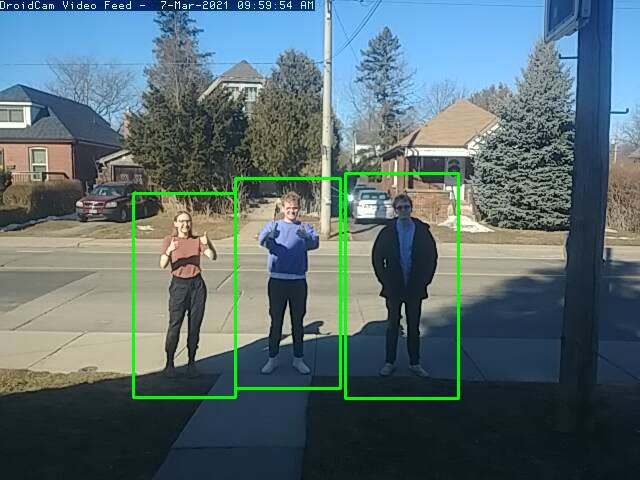

# :camera: little brother :camera:
## A non-intrusive, not scary, open source, and simple home-monitoring solution. 

Turn an old phone 📱 into something useful again using Python and OpenCV. 



Pictured above is the team, captured intelligently by the app!

[Devpost link](https://devpost.com/software/little-brother-r87)

## What do I need? 

* Old phone (Android or IOS based)
* A host machine with at least a dual-core CPU
* DroidCam or any other IP camera software
* A local area network (you don't even need internet access, just the router)
* A Gmail account from which you want to send emails 
## Installation
```bash
python -m pip install -r requirements.txt
```
## Configuration

Specific things such as the email to send info to, etc. should be specified in the root of the cloned repository,
in a YAML file named __config.yml__. An example is shown below:

```yaml
email: example@gmail.com            # email that you want information sent to by the application
ip: 192.168.0.122:4747              # IP address (with port) of the IP cam instance
framerate: 10                       # Framerate of the exported video
sender: examplesender@gmail.com     # Email you are using to send notifications
```
Next, make sure you configure your gmail account from which you want to **send** emails. I recommend creating a **throwaway** account quickly to serve as your email for this project. Then, go ahead and toggle the following setting to *on* as seen in the attached image:


[This can also be found by clicking here!](https://myaccount.google.com/security) Google warns there is a security risk by doing this, so make sure you have a strong password and that this account is not an important one to you.

## References

This project uses openCV's Histogram of Oriented Gradients method to detect humans in its field of view. This paper goes 
into detail on HOG: https://lear.inrialpes.fr/people/triggs/pubs/Dalal-cvpr05.pdf 


